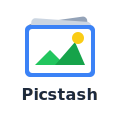

# Picstash




イラストや画像作品を整理・管理するアプリケーションです。AI が画像を自動解析して属性や説明を付けるため、手作業でのタグ付けがほぼ不要です。

## 使用例

**ダウンロードした ZIP から必要な絵だけ取り込む**
1. ZIP ファイルをドロップ
2. サムネイル一覧から取り込みたい画像を選択
3. インポート実行 → AI が自動で属性を付与

**「あの作者の絵」をまとめて見る**
1. 検索バーで「作者 = 山田太郎」と入力
2. 該当作品がギャラリーに一覧表示

**シリーズ漫画を順番に読む**
1. コレクション「○○漫画」を作成
2. 該当画像を追加して並び替え
3. コレクションを開いてページ送りで閲覧

**重複画像を整理する**
1. 類似画像検出を実行
2. 同一・類似の画像がグループ表示される
3. 不要な重複を選んで削除

## 主な機能

| カテゴリ | 機能 |
|----------|------|
| 取り込み | 画像のドラッグ＆ドロップ、ZIP/RAR/7z インポート、動画対応（MP4/WebM/GIF） |
| 整理 | 属性ラベル（作者・キャラクター等）、AI 自動属性付与、類似画像検出 |
| 閲覧 | 属性・キーワード検索、コレクション、閲覧履歴に基づく推薦 |

## 技術スタック

- **言語**: TypeScript
- **フロントエンド**: React 19 + Vite 7, Mantine 8, TanStack Query
- **バックエンド**: Fastify 5, Prisma 7
- **データベース**: SQLite (better-sqlite3)
- **AI/ML**: Florence-2 (キャプション), CLIP (類似検索), Ollama (LLM)
- **テスト**: Vitest
- **リンター**: ESLint 9 (Flat Config)

## セットアップ

```bash
# 依存関係のインストール
npm install

# データベースのセットアップ
npm run db:migrate

# 開発サーバーの起動（フロント + バック + Ollama 同時）
npm run dev
```

開発サーバー起動後:
- フロントエンド: http://localhost:5173
- バックエンド API: http://localhost:3000
- Ollama API: http://localhost:11434

### Ollama のセットアップ（オプション）

画像の説明文生成を高品質化するため、ローカル LLM (Ollama) を使用できます。

```bash
# devenv を使用している場合は自動でインストールされます
# 手動インストールの場合: https://ollama.com/download

# モデルのダウンロード（初回のみ、約2GB）
ollama pull llama3.2
```

Ollama が利用できない場合でも、従来の Florence-2 + NLLB 翻訳による説明生成は動作します。

**環境変数（オプション）**:
- `OLLAMA_URL`: Ollama API の URL（デフォルト: `http://localhost:11434`）
- `OLLAMA_MODEL`: 使用するモデル（デフォルト: `llama3.2`）

## ライセンス表記

このリポジトリは、以下のライセンスからお好きなものを選択して利用できます：

- **Apache License, Version 2.0**
  [Apache License 2.0](https://www.apache.org/licenses/LICENSE-2.0) の条項に基づき、このリポジトリを使用、変更、配布できます。

- **Mozilla Public License, Version 2.0**
  [Mozilla Public License 2.0](https://www.mozilla.org/MPL/2.0/) の条項に基づき、このリポジトリを使用、変更、配布できます。

注意：このリポジトリへの貢献または使用により、選択したライセンスの全文に同意したものとみなされます。

[LICENSE](./LICENSE) も併せてご確認ください。
